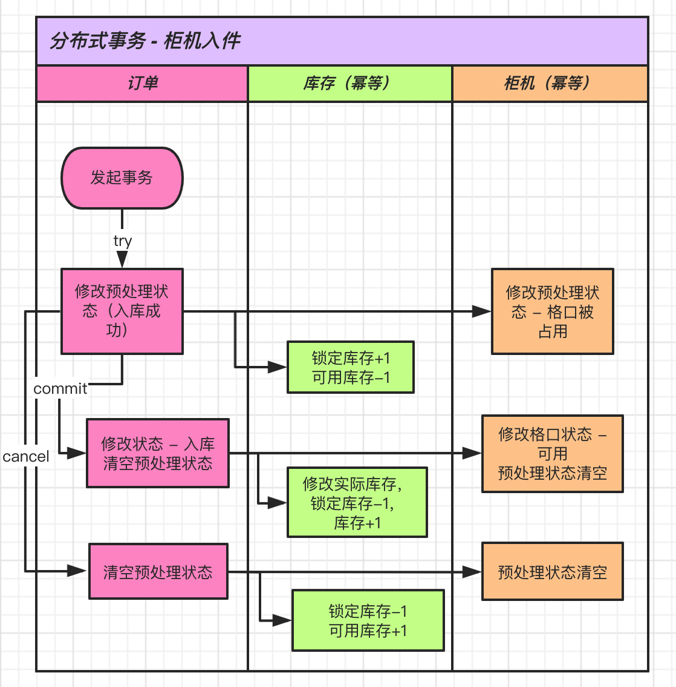

**项目介绍**

这是一个tcc事务实现的demo，它模拟的业务是智能仓储柜，OA系统下发入库订单，员工看到订单后将对应的货物放入柜机某一个格口，关门在柜机屏幕上确认放入。后台将订单状态改为完成，柜机库存进行修改，柜机格口状态进行更新。

项目使用SpringCloud作为分布式框架，h2内存数据库。整个服务集群由`eureka`，`locker-server`，`storage-server`四个微服务构成，其中`order-server`是tcc事务的发起方服务，在`OrderController`的commit和cancel接口上。

分布式事务需求是模拟柜机扫描物品入柜，在已有入柜订单存在的情况下，柜机扫描入库物品，修改订单服务的订单状态，修改库存服务的库存，修改柜机格口状态。事务的实现逻辑是`try`时，不直接修改状态，库存的数量，而是修改预操作字段，并把库存锁住，try的作用是预执行，所以不直接修改业务数据。`try`执行成功调用`commit`，执行失败调用`cancel`，commit和cancel失败后都会放入后台重复执行，直到失败次数超过阀值，记录错误日志，人肉处理。`commit`会修改业务状态和库存数量，`cancel`是还原数据的功能。

**如何运行**

进入项目文件夹下，执行`./start.sh`，会启动4个服务。访问`http://localhost:8000/`，`http://localhost:8001/`, `http://localhost:8002/`, `http://localhost:8003/`来查看服务启动是否成功。

另开终端，执行`./shutdown.sh`，会关闭4个服务，释放被占用端口。

访问`http://localhost:8002/commit`走commit业务，访问`http://localhost:8002/cancel`走`cancel`业务。

**业务流程图**

